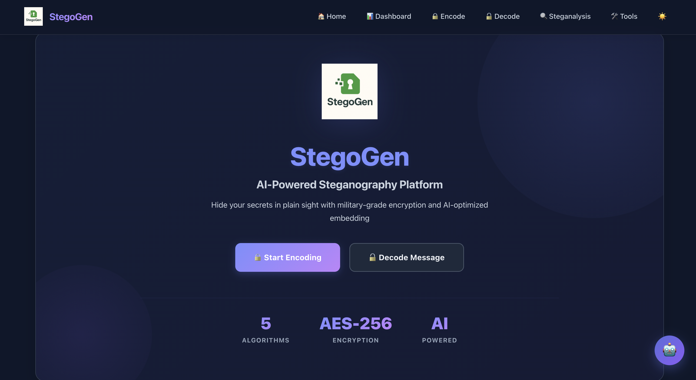

# 🔐 StegoGen - AI-Powered Multi-Algorithm Steganography Platform

<div align="center">

**Advanced steganography system supporting 5 algorithms (LSB, DCT, DWT, Audio, Video) with AI-powered recommendations and military-grade encryption.**

[](https://fastapi.tiangolo.com/)
[](https://reactjs.org/)
[](https://www.python.org/)
[](LICENSE)

</div>

---

## 🏠 Home Page Preview




## 📋 Table of Contents

- [Features](#-features)
- [Live Demo](#-live-demo)
- [Architecture](#-architecture)
- [Quick Start](#-quick-start)
- [Usage Guide](#-usage-guide)
- [API Reference](#-api-reference)
- [Algorithm Details](#-algorithm-details)
- [Security](#-security)
- [Troubleshooting](#-troubleshooting)
- [Contributing](#-contributing)
- [License](#-license)

---

## ✨ Features

### **Multiple Steganography Algorithms**
- **🎨 LSB (Least Significant Bit)**: Classic spatial domain steganography for images with high capacity
- **🌊 DCT (Discrete Cosine Transform)**: Frequency domain embedding resistant to JPEG compression
- **📊 DWT (Discrete Wavelet Transform)**: Wavelet-based embedding with excellent imperceptibility
- **🎵 Audio Steganography**: Hide data in WAV audio samples with inaudible modifications
- **🎬 Video Steganography**: Embed data across video frames (MP4, AVI, MOV, MKV) for massive capacity

### **AI-Powered Intelligence**
- **🤖 Smart Recommendations**: Grok AI analyzes carrier files and suggests optimal algorithms
- **📊 Algorithm Comparison**: Compare algorithms side-by-side with detailed scoring (Capacity, Security, Robustness, Complexity)
- **🎯 File Upload Analysis**: Upload any file to get ranked algorithm recommendations with match percentages
- **💡 Parameter Optimization**: AI suggests optimal encoding parameters based on carrier characteristics

### **Advanced Capabilities**
- **📁 Binary File Support**: Hide any file type (documents, images, archives, executables)
- **🔒 AES-256 Encryption**: Military-grade encryption for payload security
- **📈 Quality Metrics**: Automatic PSNR and SSIM calculation for image quality assessment
- **🎨 Modern UI/UX**: Beautiful React interface with glassmorphism effects and dark mode
- **⚡ RESTful API**: 15+ FastAPI endpoints for all operations
- **💻 CLI Tool**: Command-line interface for batch processing and automation

### **UI/UX Highlights**
- **Crystal Clear Stats**: Sharp, readable values across all stat cards (PSNR, SSIM, capacity)
- **Animated Comparisons**: Visual progress bars with winner highlighting and smooth animations
- **Drag-and-Drop**: Intuitive file upload with drag-and-drop support
- **Real-time Feedback**: Loading states, progress indicators, and instant validation
- **Responsive Design**: Mobile-first design with tailored breakpoints (768px, 480px)
- **Accessibility**: Improved form labels, focus indicators, and semantic HTML

---

## 🎥 Live Demo

### Encoding Interface

*Multi-algorithm encoding with AI-powered recommendations*

### Algorithm Comparison

*Side-by-side algorithm comparison with scoring and file upload analysis*

### Results Dashboard

*Clear metrics display with quality statistics*

---

## 🏗 Architecture

```
┌─────────────────┐         ┌──────────────────┐         ┌─────────────────┐
│                 │         │                  │         │                 │
│  React Frontend │ ─────→  │  FastAPI Backend │ ─────→  │   Grok AI API   │
│   (Port 3000)   │         │   (Port 8000)    │         │                 │
└─────────────────┘         └──────────────────┘         └─────────────────┘
                                      │
                    ┌─────────────────┼─────────────────┐
                    │                 │                 │
            ┌───────▼────────┐ ┌──────▼──────┐ ┌───────▼────────┐
            │  LSB Encoder/  │ │ DCT Encoder/│ │  DWT Encoder/  │
            │    Decoder     │ │   Decoder   │ │    Decoder     │
            └────────────────┘ └─────────────┘ └────────────────┘
                    │                 │                 │
            ┌───────▼────────┐ ┌──────▼──────┐ ┌───────▼────────┐
            │ Audio Encoder/ │ │Video Encoder│ │  AES-256 GCM   │
            │    Decoder     │ │  / Decoder  │ │   Encryption   │
            └────────────────┘ └─────────────┘ └────────────────┘
                    │                 │                 │
            ┌───────▼────────┐ ┌──────▼──────┐ ┌───────▼────────┐
            │Image Analyzer  │ │   Metrics   │ │    Logger      │
            │ (Texture, etc) │ │ (PSNR/SSIM) │ │                │
            └────────────────┘ └─────────────┘ └────────────────┘
```

### Tech Stack

**Frontend:**
- React 18.2.0 + React Router 6.20.0
- Axios for API communication
- CSS3 with CSS Variables for theming
- Modern glassmorphism UI with dark mode

**Backend:**
- FastAPI 0.104.1 (high-performance async framework)
- OpenCV, Pillow, NumPy, SciPy (image processing)
- PyWavelets (wavelet transforms)
- PyCryptodome (AES-256 encryption)
- FFmpeg (video processing)

**AI Integration:**
- Grok API for intelligent recommendations
- Fallback scoring system for offline operation

---

## 🚀 Quick Start

### Prerequisites
- Python 3.8+ with pip
- Node.js 14+ with npm
- FFmpeg (for video processing)
- Git

### Installation

#### 1️⃣ Clone Repository
```bash
git clone https://github.com/yourusername/steganoGen.git
cd steganoGen
```

#### 2️⃣ Backend Setup
```bash
cd backend

# Create virtual environment
python3 -m venv venv
source venv/bin/activate  # Windows: venv\Scripts\activate

# Install dependencies
pip install -r requirements.txt

# Configure environment
cp .env.example .env
# Edit .env and add your GROK_API_KEY (optional)

# Run backend server
python main.py
```
✅ Backend running at `http://localhost:8000`

#### 3️⃣ Frontend Setup
```bash
cd frontend

# Install dependencies
npm install

# Run development server
npm start
```
✅ Frontend running at `http://localhost:3000`

### First Encode/Decode Test

1. **Open browser** → `http://localhost:3000`
2. **Navigate to Encode** page
3. **Upload an image** (PNG recommended)
4. **Enter a secret message**
5. **Click "Encode Now"**
6. **Download the stego image**
7. **Navigate to Decode** page
8. **Upload stego image** with same parameters
9. **View decoded message** ✨

---

## 📖 Usage Guide

### Web Interface

#### **Encoding** (Hiding Data)

1. **Select Algorithm**:
   - `LSB`: Best for natural images, high capacity
   - `DCT`: Best for images that may be compressed
   - `DWT`: Best for maximum imperceptibility
   - `Audio`: For WAV audio files
   - `Video`: For large payloads in videos

2. **Upload Carrier File**:
   - Drag-and-drop or click to browse
   - Supported: PNG, JPEG (images), WAV (audio), MP4/AVI (video)

3. **Enter Payload**:
   - **Text**: Type your secret message
   - **File**: Upload any binary file (PDF, ZIP, etc.)

4. **Optional Encryption**:
   - Enable encryption toggle
   - Enter a strong password (16+ characters recommended)

5. **Adjust Parameters**:
   - **LSB**: Bits per channel (1-4) - higher = more capacity, less quality
   - **DCT/DWT**: Strength (1-50) - higher = more robustness, less capacity

6. **Get AI Recommendation** (Optional):
   - Click "Analyze with AI"
   - View recommended parameters and explanations

7. **Encode**:
   - Click "Encode Now"
   - View quality metrics (PSNR, SSIM)
   - Download stego file
   - **⚠️ Save settings for decoding!**

#### **Decoding** (Extracting Data)

1. **Select Same Algorithm** used for encoding
2. **Upload Stego File**
3. **Enter Same Parameters**:
   - LSB: Same bits per channel
   - DCT/DWT: Same strength value
4. **Enter Decryption Key** (if encrypted)
5. **Click "Decode Message"**
6. **View/Copy Extracted Data**

#### **Algorithm Comparison**

1. **Navigate to Compare** page
2. **Select Two Algorithms** to compare
3. **View Comparison**:
   - **Capacity**: How much data can be hidden
   - **Security**: Resistance to detection
   - **Robustness**: Resistance to modifications
   - **Complexity**: Processing speed and difficulty
4. **Upload File for Recommendations** (Optional):
   - Upload a carrier file
   - Click "Get AI Recommendation"
   - View ranked algorithm suggestions with match percentages

### Command-Line Interface

```bash
# Activate virtual environment
cd backend
source venv/bin/activate

# Encode with LSB
python cli.py encode -c image.png -p "secret message" -a lsb -b 1

# Encode with encryption
python cli.py encode -c image.png -p "secret" -a lsb -b 2 -k mypassword

# Encode with DCT
python cli.py encode -c image.jpg -p "secret" -a dct -s 15 -k password

# Encode with DWT
python cli.py encode -c image.png -p "secret" -a dwt -s 20

# Encode audio
python cli.py encode -c audio.wav -p "secret" -a audio -k password

# Encode video
python cli.py encode -c video.mp4 -p "large secret file" -a video

# Decode (use same algorithm and parameters)
python cli.py decode -s stego.png -a lsb -b 1 -k mypassword

# Get help
python cli.py --help
```

---

## 🔌 API Reference

### Base URL
```
http://localhost:8000
```

### Core Endpoints

#### **POST** `/api/analyze`
Analyzes carrier file and provides AI recommendations.

**Request (multipart/form-data)**:
```javascript
{
  carrier: File,              // Image file
  payload_text: string,       // Payload for size estimation
  goal: "max_invisibility"    // or "max_capacity"
}
```

**Response**:
```json
{
  "file_id": "uuid-here",
  "image_stats": {
    "dimensions": [1920, 1080],
    "entropy": 7.45,
    "variance": 1234.56,
    "texture_score": 125.3,
    "edge_density": 0.23
  },
  "recommendation": {
    "algorithm": "LSB",
    "bits_per_channel": 1,
    "region_hint": "smooth_areas",
    "explanation": "High texture makes LSB effective...",
    "confidence": 0.85,
    "source": "grok"
  }
}
```

### LSB Endpoints

#### **POST** `/api/encode`
LSB encoding for images.

**Request**:
```javascript
{
  carrier: File,                    // Image file (PNG/JPEG)
  payload_text: string (optional),  // Text payload
  payload_file: File (optional),    // Binary file payload
  bits_per_channel: int,            // 1-4 (default: 1)
  encryption_key: string (optional) // Encryption password
}
```

**Response**:
```json
{
  "output_filename": "stego_abc123.png",
  "download_url": "/api/download/stego_abc123.png",
  "metrics": {
    "psnr": 79.89,
    "ssim": 1.0000
  },
  "encode_info": {
    "algorithm": "LSB",
    "bits_per_channel": 1,
    "payload_size": 123,
    "capacity_used": 0.05
  }
}
```

#### **POST** `/api/decode`
LSB decoding for images.

**Request**:
```javascript
{
  stego_image: File,                // Stego image
  bits_per_channel: int,            // Must match encoding
  decryption_key: string (optional) // If encrypted
}
```

**Response**:
```json
{
  "payload": "decoded message",
  "payload_size": 123,
  "was_encrypted": true,
  "is_binary": false,
  "payload_base64": "aGVsbG8="  // For binary payloads
}
```

### DCT Endpoints

#### **POST** `/api/encode/dct`
DCT frequency domain encoding.

**Request**: Same as LSB but with `strength` (1-50) instead of `bits_per_channel`

#### **POST** `/api/decode/dct`
DCT decoding. **Request**: Same as LSB decode but with `strength`

### DWT Endpoints

#### **POST** `/api/encode/dwt`
DWT wavelet domain encoding. Same parameters as DCT.

#### **POST** `/api/decode/dwt`
DWT decoding. Same parameters as DCT decode.

### Audio Endpoints

#### **POST** `/api/encode/audio`
Audio steganography (WAV only).

**Request**:
```javascript
{
  carrier_file: File,               // WAV audio
  payload_text: string (optional),
  payload_file: File (optional),
  encryption_key: string (optional)
}
```

#### **POST** `/api/decode/audio`
Audio decoding.

### Video Endpoints

#### **POST** `/api/encode/video`
Video steganography (MP4/AVI/MOV/MKV).

#### **POST** `/api/decode/video`
Video decoding.

### Utility Endpoints

#### **GET** `/api/download/{filename}`
Download generated stego files.

#### **GET** `/health`
Health check endpoint. Returns `{"status": "healthy"}`

---

## 🔬 Algorithm Details

### Comparison Matrix

| Algorithm | Domain | Capacity | Security | Robustness | Speed | PSNR (dB) | SSIM |
|-----------|--------|----------|----------|------------|-------|-----------|------|
| **LSB**   | Spatial | ★★★★★ (100) | ★★★☆☆ (60) | ★★☆☆☆ (50) | ★★★★★ | 70-80 | 1.00 |
| **DCT**   | Frequency | ★★★☆☆ (65) | ★★★★☆ (80) | ★★★★★ (90) | ★★★☆☆ | 50-55 | 0.99 |
| **DWT**   | Wavelet | ★★★☆☆ (70) | ★★★★★ (85) | ★★★★★ (85) | ★★☆☆☆ | 55-60 | 0.99 |
| **Audio** | Spatial | ★★★★☆ (95) | ★★★★☆ (70) | ★★★☆☆ (65) | ★★★★☆ | N/A (SNR) | N/A |
| **Video** | Spatial | ★★★★★ (100) | ★★★★☆ (75) | ★★★☆☆ (70) | ★☆☆☆☆ | 40-50 | 0.98 |

*Scores out of 100*

### LSB (Least Significant Bit)

**Best For**: Natural images with textures, maximum capacity needs

**How It Works**:
- Modifies the least significant bits of RGB pixel values
- 1 bit/channel = 3 bits per pixel = 37.5% capacity per bit level
- Imperceptible to human eye (changes of ±1-4 in 0-255 range)

**Pros**:
✅ Very high capacity  
✅ Simple and fast  
✅ Excellent image quality (PSNR 70-80 dB)

**Cons**:
❌ Fragile to compression and image processing  
❌ Detectable by statistical steganalysis (Chi-square, RS analysis)  
❌ Not robust to JPEG compression

**Parameters**:
- `bits_per_channel` (1-4): Higher = more capacity, lower quality

**Use Cases**: 
- Quick message hiding in lossless formats (PNG)
- Maximum capacity requirements
- Images that won't be compressed

---

### DCT (Discrete Cosine Transform)

**Best For**: Images that may undergo JPEG compression

**How It Works**:
- Divides image into 8×8 blocks
- Applies DCT to each block (same as JPEG compression)
- Embeds data in mid-frequency coefficients (position 4,4)
- Uses sign-based embedding (±strength)

**Pros**:
✅ Resistant to JPEG compression  
✅ More secure than LSB  
✅ Balanced quality and capacity

**Cons**:
❌ Lower capacity (~5-10% of image size)  
❌ Slower than LSB  
❌ More complex parameter tuning

**Parameters**:
- `strength` (1-50): Higher = more robust, lower capacity

**Use Cases**:
- Images that will be compressed
- JPEG workflows
- Balanced security/capacity

---

### DWT (Discrete Wavelet Transform)

**Best For**: Maximum imperceptibility and robustness

**How It Works**:
- Applies Haar wavelet decomposition
- Embeds in horizontal detail coefficients (HL subband)
- Uses sign-based embedding with adaptive strength
- Preserves visual quality better than DCT

**Pros**:
✅ Excellent imperceptibility (PSNR 55-60 dB)  
✅ Highly robust to image processing  
✅ Better than DCT for high-security needs

**Cons**:
❌ Lower capacity (~0.5-1% of image size)  
❌ Slowest algorithm  
❌ Complex implementation

**Parameters**:
- `strength` (1-50): Higher = more robust, lower capacity

**Use Cases**:
- Maximum security requirements
- High-quality images
- Professional/research applications

---

### Audio Steganography

**Best For**: Voice recordings, music, large payloads

**How It Works**:
- Modifies LSBs of 16-bit audio samples
- Works with stereo or mono WAV files
- Embeds data in both channels
- Typical SNR > 40 dB (inaudible)

**Pros**:
✅ Large capacity (0.1-0.5% of audio size)  
✅ Inaudible modifications  
✅ Fast processing

**Cons**:
❌ WAV format only (uncompressed)  
❌ Sensitive to audio re-encoding (MP3 conversion destroys data)  
❌ Large file sizes

**Use Cases**:
- Voice note hiding
- Music files (lossless)
- Audio-based communication

---

### Video Steganography

**Best For**: Very large payloads, distributed hiding

**How It Works**:
- Embeds in I-frames (keyframes) only
- Uses LSB modification per frame pixel
- Distributes data across multiple frames
- Typical capacity: 1-5% of video size

**Pros**:
✅ Huge capacity (GBs for long videos)  
✅ Distributed hiding (harder to detect)  
✅ Works with multiple formats

**Cons**:
❌ Very slow processing (5-10 sec per minute)  
❌ Format sensitive (re-encoding may corrupt)  
❌ Large file sizes

**Use Cases**:
- Very large files (archives, databases)
- Long-form content
- Research and testing

---

## 🔐 Security

### Encryption Details

**Algorithm**: AES-256-GCM (Galois/Counter Mode)
- **Key Size**: 256 bits
- **Key Derivation**: PBKDF2-HMAC-SHA256 with 100,000 iterations
- **IV**: Random 16-byte initialization vector per encryption
- **Authentication**: GCM provides built-in authentication tag

**Metadata Format**:
```
STEGANO|encrypted|<base64_iv>|<base64_encrypted_data>
```

### Best Practices

1. **Strong Keys**: Use 16+ character passwords with mixed case, numbers, symbols
2. **Unique Carriers**: Never reuse carrier files (statistical attacks possible)
3. **Lossless Formats**: 
   - Images: PNG (not JPEG)
   - Audio: WAV (not MP3)
   - Video: Original format (avoid re-encoding)
4. **Parameter Documentation**: Record all encoding parameters securely
5. **Test First**: Always test decode before relying on stego file
6. **Secure Storage**: Keep original carriers secure and separate from stego files

### Threat Model

**What StegoGen Protects Against**:
✅ Casual observation (files look identical)  
✅ Simple file inspection (hidden data not visible)  
✅ Brute force (AES-256 with strong keys)  
✅ Statistical analysis (DCT/DWT are more resistant)

**What It Doesn't Protect Against**:
❌ Targeted steganalysis by experts  
❌ Machine learning-based detection  
❌ Known-plaintext attacks (if attacker has original)  
❌ Compression (LSB fails with JPEG/MP3)

### Legal Disclaimer

⚠️ **Use Responsibly**: Steganography may be restricted in some jurisdictions. This tool is for:
- Educational purposes
- Security research
- Legitimate privacy protection
- Digital watermarking

**Not for**:
- Illegal activities
- Unauthorized data exfiltration
- Bypassing security systems
- Malicious purposes

---

## 🎯 Use Cases

### Legitimate Applications

1. **Digital Watermarking**: Embed copyright information in images/videos
2. **Secure Communication**: Private messaging in censorship-heavy environments
3. **Data Integrity**: Hidden checksums for tamper detection
4. **Steganography Research**: Academic studies and algorithm development
5. **Penetration Testing**: Security assessments and red team exercises
6. **Privacy Protection**: Storing sensitive notes in innocent files
7. **Authentication**: Hidden signatures in documents

### Research Applications

- **Steganalysis Development**: Testing detection algorithms
- **Machine Learning**: Training models to detect steganography
- **Forensics**: Understanding data hiding techniques
- **Cryptography**: Combining encryption with steganography

---

## 🐛 Troubleshooting

### Common Errors

#### ❌ "Payload too large for carrier"

**Solutions**:
- Reduce payload size (compress files before hiding)
- Use higher `bits_per_channel` for LSB (2-4)
- Use video steganography for very large payloads
- Split payload across multiple carriers

---

#### ❌ "Decoding failed" or "Invalid payload"

**Checklist**:
1. ✅ Same algorithm as encoding?
2. ✅ Same parameters (bits/strength)?
3. ✅ Correct encryption key (if encrypted)?
4. ✅ File not modified after encoding?
5. ✅ File not compressed (JPEG/MP3)?

---

#### ❌ "Import errors" (Missing dependencies)

```bash
cd backend
source venv/bin/activate
pip install --upgrade pip
pip install -r requirements.txt
```

---

#### ❌ "Port already in use"

**Backend (port 8000)**:
```bash
# macOS/Linux
lsof -ti:8000 | xargs kill -9

# Windows
netstat -ano | findstr :8000
taskkill /PID <PID> /F
```

**Frontend (port 3000)**:
```bash
# macOS/Linux
lsof -ti:3000 | xargs kill -9

# Windows
netstat -ano | findstr :3000
taskkill /PID <PID> /F
```

---

#### ❌ "CORS errors" in browser console

**Solution**: Ensure backend CORS is configured:
```python
# backend/main.py should have:
app.add_middleware(
    CORSMiddleware,
    allow_origins=["http://localhost:3000"],
    allow_credentials=True,
    allow_methods=["*"],
    allow_headers=["*"],
)
```

---

#### ❌ "FFmpeg not found" (Video encoding)

**Install FFmpeg**:
```bash
# macOS
brew install ffmpeg

# Ubuntu/Debian
sudo apt-get install ffmpeg

# Windows
# Download from https://ffmpeg.org/download.html
# Add to PATH environment variable
```

---

#### ❌ "AI recommendations not working"

**Fallback Mode**: System uses built-in scoring if Grok API unavailable
- Check `.env` for valid `GROK_API_KEY`
- Verify internet connection
- Fallback provides same functionality without AI explanations

---

## 📂 Project Structure

```
steganoGen/
├── backend/
│   ├── main.py                      # FastAPI app (15+ endpoints)
│   ├── config.py                    # Environment config
│   ├── logger.py                    # Logging setup
│   ├── cli.py                       # CLI tool
│   ├── requirements.txt             # Python dependencies
│   ├── .env.example                 # Environment template
│   ├── stego/
│   │   ├── __init__.py
│   │   ├── lsb_encoder.py          # LSB encoding
│   │   ├── lsb_decoder.py          # LSB decoding
│   │   ├── dct_encoder.py          # DCT encoding
│   │   ├── dct_decoder.py          # DCT decoding
│   │   ├── dwt_encoder.py          # DWT encoding
│   │   ├── dwt_decoder.py          # DWT decoding
│   │   ├── audio_wav_encoder.py    # Audio encoding
│   │   ├── audio_wav_decoder.py    # Audio decoding
│   │   ├── video_encoder.py        # Video encoding
│   │   ├── video_decoder.py        # Video decoding
│   │   ├── crypto.py               # AES-256 encryption
│   │   ├── analyzer.py             # Image analysis
│   │   ├── metrics.py              # PSNR/SSIM calculation
│   │   ├── ai_adapter.py           # Grok AI integration
│   │   ├── ai_explainer.py         # Algorithm explanations
│   │   ├── ai_steganalysis.py      # Steganalysis detection
│   │   └── ai_report_generator.py  # PDF report generation
│   ├── uploads/                    # Temporary uploads
│   ├── outputs/                    # Generated stego files
│   └── test_files/                 # Test data
├── frontend/
│   ├── public/
│   │   ├── index.html
│   │   └── logo/
│   ├── src/
│   │   ├── App.js                  # Main app component
│   │   ├── App.css                 # Global styles
│   │   ├── index.js                # Entry point
│   │   ├── index.css               # Root CSS variables
│   │   ├── config.js               # API config
│   │   ├── components/
│   │   │   ├── Home.js             # Landing page
│   │   │   ├── Home.css
│   │   │   ├── Encode.js           # Encoding interface
│   │   │   ├── Encode.css
│   │   │   ├── Decode.js           # Decoding interface
│   │   │   ├── Decode.css
│   │   │   ├── AlgorithmComparison.js  # Algorithm comparison
│   │   │   ├── AlgorithmComparison.css
│   │   │   ├── Dashboard.js        # Stats dashboard
│   │   │   └── Dashboard.css
│   │   └── utils/
│   │       └── apiClient.js        # API utilities
│   ├── package.json
│   └── .env.example
├── logo/                           # Project logos
├── .gitignore                      # Git ignore rules
├── README.md                       # This file
├── LICENSE                         # MIT License
└── CONTRIBUTING.md                 # Contribution guidelines
```

---

## 🤝 Contributing

Contributions are welcome! Please see [CONTRIBUTING.md](CONTRIBUTING.md) for guidelines.

### Development Setup

1. Fork the repository
2. Create a feature branch (`git checkout -b feature/amazing-feature`)
3. Make your changes
4. Run tests (if available)
5. Commit changes (`git commit -m 'Add amazing feature'`)
6. Push to branch (`git push origin feature/amazing-feature`)
7. Open a Pull Request

### Code Style

- **Python**: Follow PEP 8
- **JavaScript**: Use ES6+ features
- **React**: Functional components with hooks
- **CSS**: Use CSS variables for theming

---

## 📈 Roadmap

- [x] Multi-algorithm support (LSB, DCT, DWT)
- [x] Audio/Video steganography
- [x] Binary file payloads
- [x] AES-256 encryption
- [x] AI-powered recommendations
- [x] CLI tool
- [x] Algorithm comparison with scoring
- [x] File upload for recommendations
- [ ] Batch processing support
- [ ] Steganalysis detection mode
- [ ] Advanced AI features (custom training)
- [ ] Mobile app (React Native)
- [ ] Docker containerization
- [ ] Unit/Integration tests
- [ ] Performance benchmarks
- [ ] Custom encryption algorithms

---

## 📄 License

This project is licensed under the MIT License - see the [LICENSE](LICENSE) file for details.

**TL;DR**: You can use, modify, and distribute this software freely, but must include the original license.

---

## 👥 Author

**Syed Wamiq**  
🌐 [Portfolio](https://syedwamiq.framer.website)  
📧 [Contact](mailto:your-email@example.com)

*Project demonstrating advanced steganography techniques with AI integration for educational and research purposes.*

---

## 🙏 Acknowledgments

- **FastAPI** - Modern Python web framework
- **React** - UI library
- **OpenCV** - Computer vision library
- **Grok AI** - AI-powered recommendations
- **NIST** - AES-256 encryption standard

---

## 📚 References

### Academic Papers
- LSB Steganography: Classical spatial domain technique
- DCT: Based on JPEG compression principles (ISO/IEC 10918-1)
- DWT: Haar wavelet decomposition
- AES-256: NIST FIPS 197 standard
- PSNR/SSIM: Image quality metrics (IEEE standards)

### Useful Links
- [Steganography Overview](https://en.wikipedia.org/wiki/Steganography)
- [JPEG DCT](https://en.wikipedia.org/wiki/JPEG#Encoding)
- [Discrete Wavelet Transform](https://en.wikipedia.org/wiki/Discrete_wavelet_transform)
- [AES Encryption](https://en.wikipedia.org/wiki/Advanced_Encryption_Standard)

---

<div align="center">

**Version**: 2.1  
**Last Updated**: January 2025  
**API Version**: v1

---

By [Syed Wamiq](https://syedwamiq.framer.website)

wamiqworkspace@gmail.com

</div>